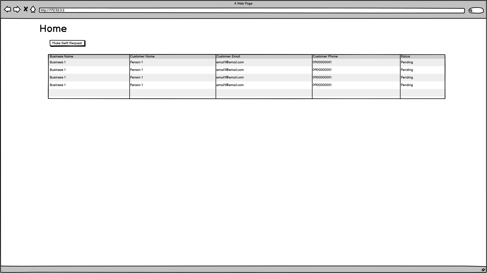
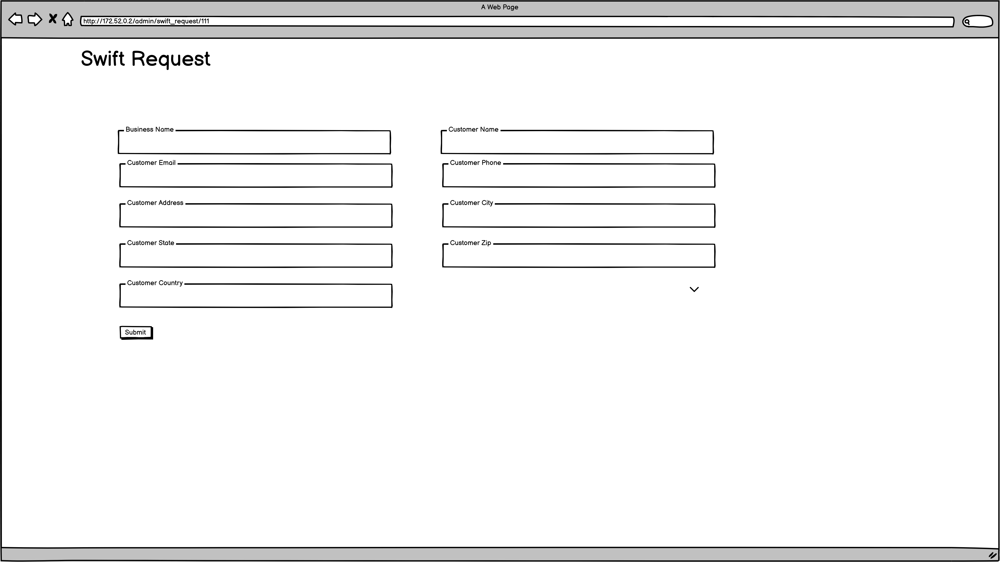
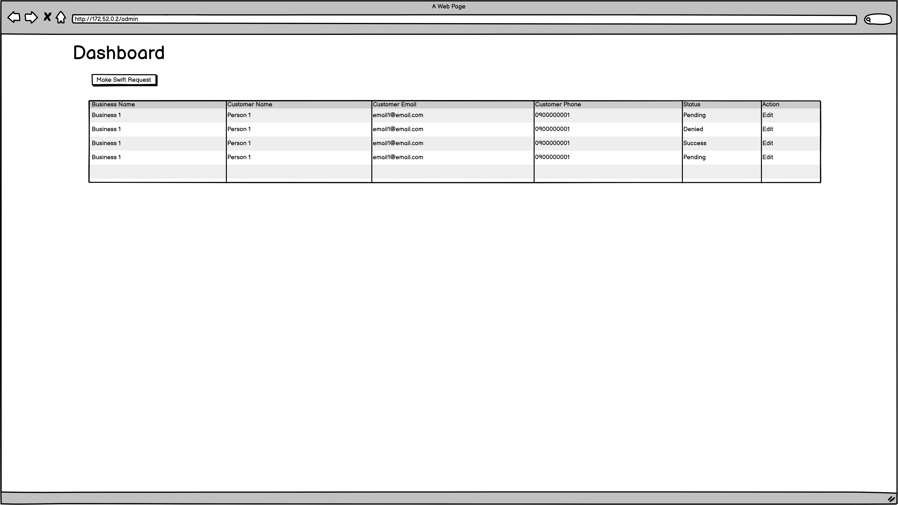
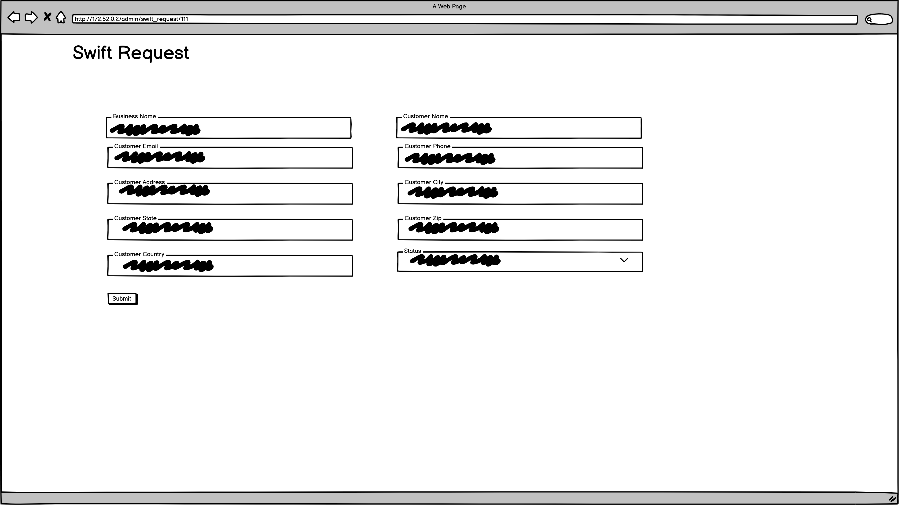

# Haron Computers CRM

## Requirement and Design Flow

### User Profiles

- Admins
- Business Customers

### Functional Requirements

- Web form for Business customers to submit SWIFT connect requests. 
- CRM module to process and manage incoming SWIFT connect requests.

### Non-Functional Requirements

- The system should respond to user interactions within an acceptable time frame.
- Database queries and operations should be optimized for performance.
- User data, especially sensitive information like contact details, should be securely stored in the database.
- The application should be reliable, minimizing downtime and ensuring continuous availability.
- The web application should be compatible with popular web browsers to ensure a consistent user experience.
- Future updates or enhancements should be straightforward to implement.

### Wireframes

|                                                                 |                                                                                        |
|:---------------------------------------------------------------:|:--------------------------------------------------------------------------------------:|
|                   |            |
|  |  |

## Setup

### Pre-requisites

- [Docker](https://docs.docker.com/get-docker/)

### Installation

1. Clone the repository

    ```bash
    git clone https://github.com/mubareksd/haron_crm.git
    ```

2. Copy the `.env.example` file to `.env`

    ```bash
    cp .env.example .env
    ```

3. Update the `.env` file with your application settings

4. Build the containers

    ```bash
    docker-compose build
    ```

5. Start the containers

    ```bash
    docker-compose up -d
    ```

## Usage

### Accessing the application

The application will be available at [http://172.52.0.2](http://172.52.0.2)

### Accessing the database

phpMyAdmin will be available at [http://172.52.0.4](http://172.52.0.4)